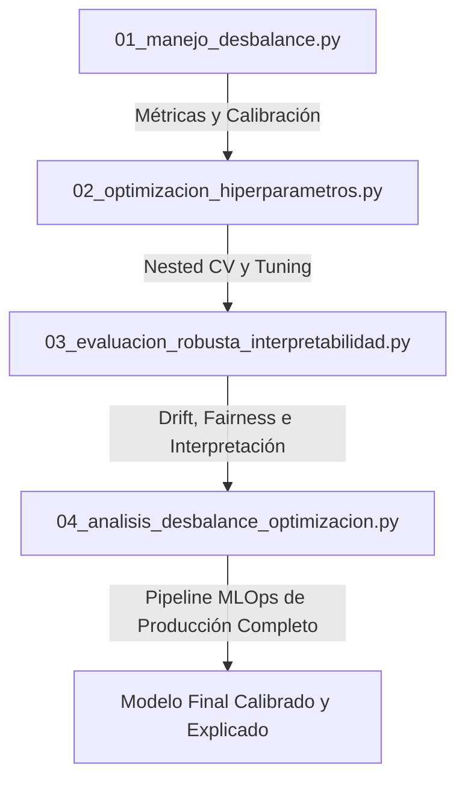

# 🎯 Módulo 7: Evaluación y Optimización Avanzada

[](https://python.org)
[](https://scikit-learn.org)
[](https://optuna.org)
[](https://github.com/shap/shap)
[](https://opensource.org/licenses/MIT)

Este repositorio contiene el material de código correspondiente al **Módulo 7: Evaluación y Optimización Avanzada** del curso *Python para IA y Webscraping* de **New Horizons**. Aquí encontrarás implementaciones prácticas de nivel profesional que demuestran cómo estructurar pipelines de Machine Learning robustos, resolver el desbalance de clases extremo, calibrar modelos, aplicar optimización bayesiana e interpretar decisiones complejas.

---

## 🛠️ Estructura del Repositorio

El repositorio está compuesto por cuatro scripts principales estructurados pedagógicamente de menor a mayor complejidad:



### 📋 Detalle de los Scripts

Despliega cada sección a continuación para conocer los conceptos y metodologías implementadas en cada script:

<details>
<summary><b>🔍 Script 1: Técnicas para el Manejo de Desbalance de Clases (01_manejo_desbalance.py)</b></summary>
<br>

* **Propósito:** Abordar problemas reales con clases minoritarias extremas y costos de negocio asimétricos.
* **Dataset:** *German Credit Dataset* (UCI / OpenML), con desbalance forzado al 5%.
* **Conceptos clave:**
  * **Remuestreo vs Ponderación:** Comparativa directa entre SMOTE (remuestreo sintético) y `class_weight='balanced'` (pesos de clase).
  * **Métricas Robustas:** Análisis de por qué *Accuracy* y *ROC-AUC* son engañosos con desbalance, y cómo utilizar *F2-Score*, *Matthews Correlation Coefficient (MCC)* y *PR-AUC* (Precision-Recall Area Under Curve).
  * **Optimización Financiera:** Ajuste del umbral de decisión basado en costos financieros (Falsos Negativos = \$1,000 frente a Falsos Positivos = \$100).
  * **Calibración de Probabilidades:** Comparación entre *Platt Scaling* (Sigmoide) e *Isotonic Regression*, evaluados mediante *Brier Score Loss*.
* **Gráficos Generados:**
  * `01_curvas_roc_vs_pr.png`: Comparación de desempeño.
  * `02_optimizacion_umbral_costos.png`: Curva de minimización de costos.
  * `03_calibracion_probabilidades.png`: Curva de calibración / Diagrama de confiabilidad.
</details>

<details>
<summary><b>⚙️ Script 2: Optimización de Hiperparámetros y Nested CV (02_optimizacion_hiperparametros.py)</b></summary>
<br>

* **Propósito:** Tunear hiperparámetros de manera científica previniendo el sesgo de optimismo (*tuning optimism*).
* **Dataset:** *SMS Spam Collection* (Datos de clasificación de texto / NLP).
* **Conceptos clave:**
  * **Pipeline Integrado:** Vectorización de texto con TF-IDF acoplada al clasificador en un único flujo de Scikit-Learn.
  * **Búsquedas Avanzadas:** Comparación de búsqueda aleatoria clásica frente a la Optimización Bayesiana (TPE) usando **Optuna**.
  * **Nested Cross-Validation (CV Anidado):** Implementación de un doble bucle (interno para selección de parámetros, externo para evaluar generalización real ante datos nunca vistos).
* **Gráficos Generados:**
  * `04_nested_cv_scores.png`: Distribución de métricas en los bucles externos de validación.
</details>

<details>
<summary><b>⌛ Script 3: Evaluación Robusta, Interpretabilidad y Drift (03_evaluacion_robusta_interpretabilidad.py)</b></summary>
<br>

* **Propósito:** Probar la resiliencia del modelo en producción, auditar sesgos, e implementar monitoreo continuo.
* **Dataset:** *Daily Minimum Temperatures in Melbourne* (Datos con estructura de Series de Tiempo).
* **Conceptos clave:**
  * **Validación Temporal:** Uso de `TimeSeriesSplit` respetando la dependencia del tiempo (Expanding Window).
  * **Explicabilidad Global y Local:** Permutación de importancia de variables y análisis local de contribuciones frente a promedios históricos.
  * **Fairness / Sesgo de Subgrupos:** Comparativa de desempeño (MAE) en invierno vs. verano.
  * **Monitoreo Continuo y Drift:** Cálculo del *Population Stability Index (PSI)* manual y Test de *Kolmogorov-Smirnov (KS)* para detectar desvíos de covariables (*Covariate Drift*) y cambios de concepto (*Concept Drift*) con políticas de reentrenamiento automático.
  * **Stress Testing:** Simulación de fallos del sensor (datos nulos) e inyección de ruido gaussiano de alta varianza.
* **Gráficos Generados:**
  * `05_timeseries_splits.png`: Diagrama de folds de la serie de tiempo.
  * `06_global_interpretability.png`: Permutation Feature Importance.
  * `07_production_drift_monitoring.png`: Seguimiento del PSI y degradación del MAE mes a mes en producción.
</details>

<details>
<summary><b>🏆 Script 4: Pipeline Completo de Producción MLOps (04_analisis_desbalance_optimizacion.py)</b></summary>
<br>

* **Propósito:** Integrar todos los tópicos anteriores en un único pipeline de Machine Learning automatizado y escalable.
* **Dataset:** *Credit Card Fraud Detection* (Kaggle).
* **Flujo del Pipeline:**
  1. **Submuestreo Inteligente:** Preservación de fraudes y reducción aleatoria de no-fraudes para un entrenamiento rápido.
  2. **Competencia Multimodelo:** Evaluación simultánea de Regresión Logística, Random Forest y Gradient Boosting.
  3. **Selección del Ganador:** Elección automática basada en la métrica MCC.
  4. **Tuning con Nested CV:** Comparación en vivo de Random Search vs. Optuna sobre el algoritmo ganador.
  5. **Evaluación de Subgrupos:** Test KS y PSI de estabilidad en transacciones de Monto Alto (> \$100) vs. Monto Bajo.
  6. **Interpretación Avanzada:** Extracción de importancia nativa y cálculo de valores SHAP (Beeswarm Plot).
  7. **Calibración de Probabilidades:** Ajuste Isotónico final con medición del porcentaje de reducción de Brier Score.
* **Gráficos Generados:**
  * `08_feature_importance.png`: Importancia de variables nativa del ganador.
  * `09_shap_beeswarm.png`: Distribución del impacto local de características con SHAP.
</details>

---

## 🚀 Requisitos e Instalación

Para asegurar que todos los scripts funcionen a nivel local y puedan ejecutar las demostraciones avanzadas (incluyendo Optuna, imbalanced-learn y SHAP), instala las dependencias necesarias.

### 1. Clonar el repositorio
```bash
git clone https://github.com/andyterr170796/NH_m7.git
cd NH_m7
```

### 2. Instalar dependencias
Se recomienda utilizar un entorno virtual (venv o conda):

```bash
pip install numpy pandas matplotlib seaborn scikit-learn scipy optuna imbalanced-learn shap
```

> [!NOTE]
> Los scripts manejan automáticamente la ausencia de librerías externas opcionales (como `imblearn` o `optuna`), ejecutando alternativas robustas estándar si no se encuentran instaladas. No obstante, se recomienda instalarlas para aprovechar todo el potencial del módulo.

---

## 📊 Visualización de Resultados

Una vez ejecutados los scripts, se generarán automáticamente las siguientes gráficas en la carpeta raíz para el análisis visual de desempeño y diagnóstico:

* **Manejo de Desbalance:** `01_curvas_roc_vs_pr.png`, `02_optimizacion_umbral_costos.png`, `03_calibracion_probabilidades.png`
* **Hiperparámetros:** `04_nested_cv_scores.png`
* **Validación Robusta y Drift:** `05_timeseries_splits.png`, `06_global_interpretability.png`, `07_production_drift_monitoring.png`
* **Pipeline Integrado (MLOps):** `08_feature_importance.png`, `09_shap_beeswarm.png`

---
*Diseñado por el equipo de capacitación docente para el curso de Python para IA y Webscraping - New Horizons.*
